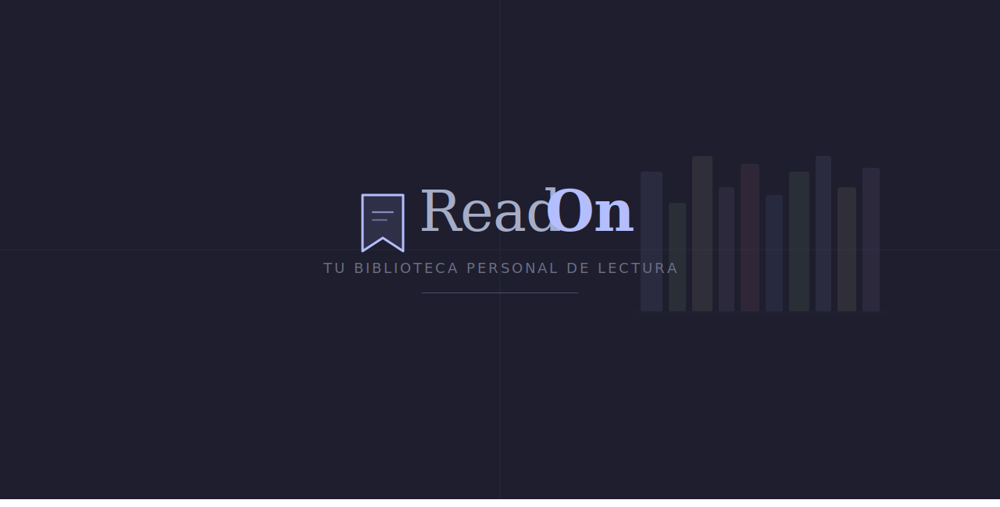
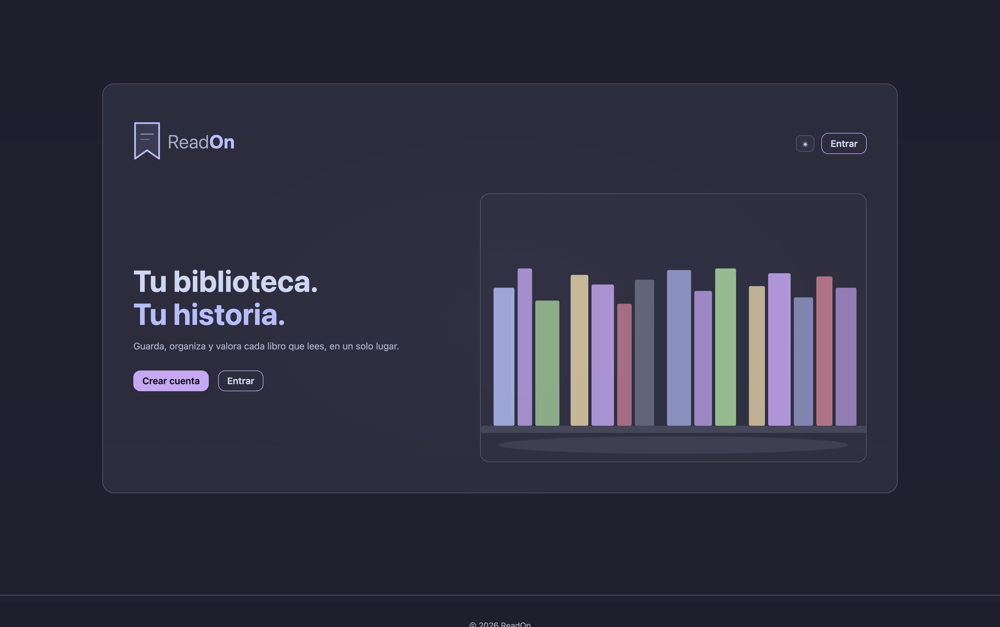
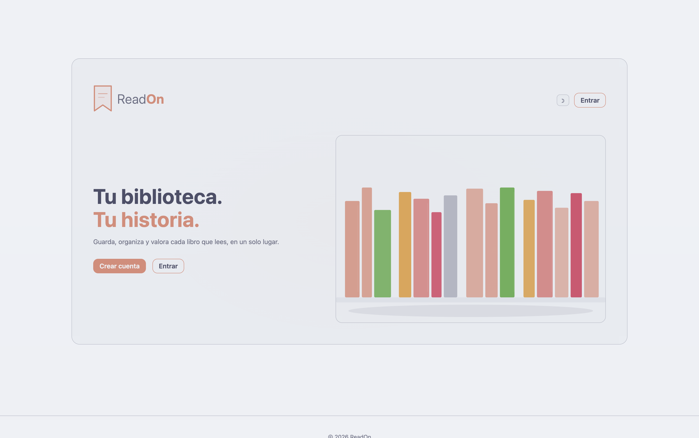
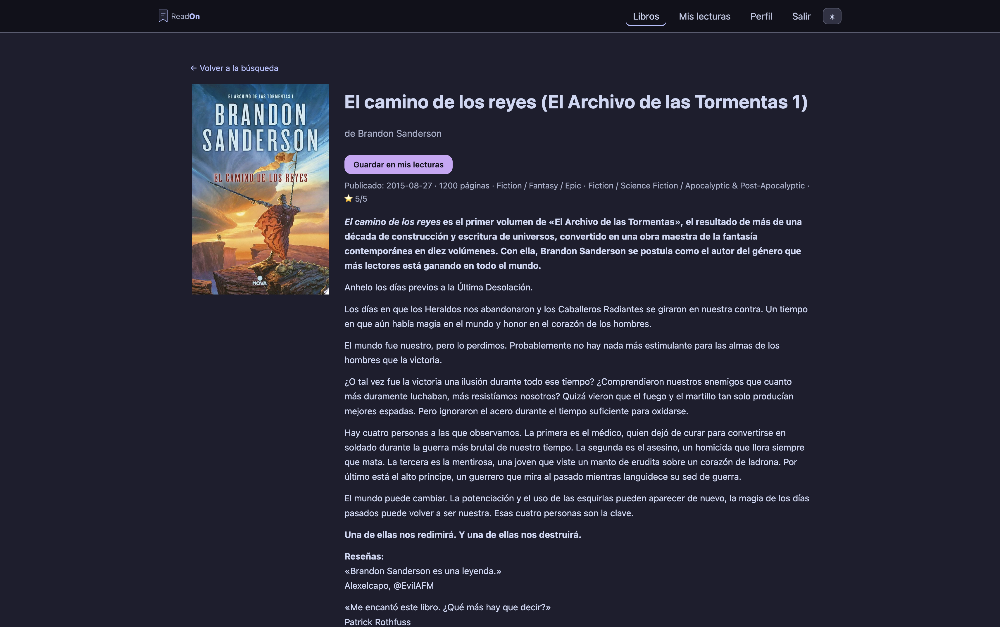
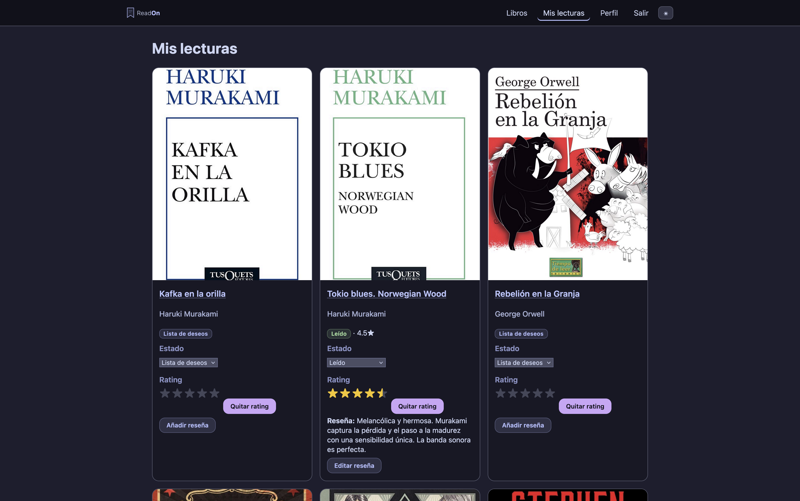
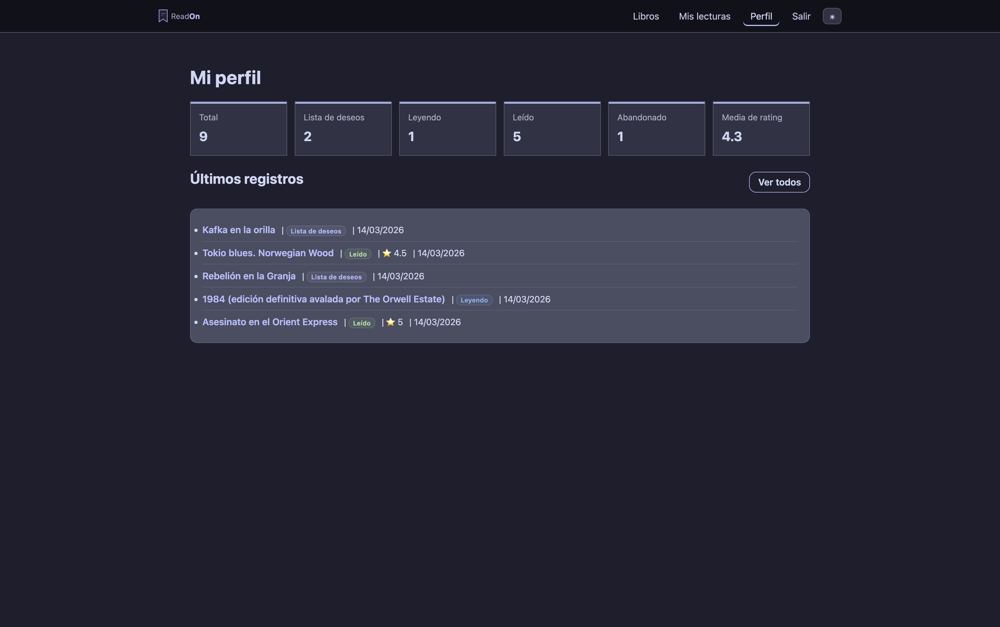

# ReadOn


Aplicación web para registrar, seguir y reseñar libros, inspirada en Letterboxd pero orientada a lecturas.
Proyecto personal de portfolio, enfocado en una arquitectura clara, UX cuidada y un stack sencillo y mantenible.

---

| Dark (Mocha) | Light (Latte) |
|---|---|
|  |  |

| Búsqueda | Detalle de libro |
|---|---|
|  |  |

| Mis lecturas | Perfil |
|---|---|
|  |  |

---

## 🛠️ Stack

| Capa | Tecnología |
|---|---|
| Backend | Laravel 11 + Blade |
| Base de datos | PostgreSQL |
| Frontend | SCSS + Vite (BEM, sin Tailwind) |
| Temas | Catppuccin Mocha / Latte |
| Entorno | DDEV · Docker · PHP 8.2 · nginx-fpm |
| Tests | PHPUnit · SQLite in-memory |

---

## 🚀 Puesta en marcha (local)

Requisitos: [DDEV](https://ddev.readthedocs.io/en/stable/)

```bash
git clone git@github.com:CristianSG2/ReadOn.git
cd ReadOn
ddev start
ddev composer install
ddev npm install
ddev artisan key:generate
```

Añadir en `.env`:
```
GOOGLE_BOOKS_API_KEY=tu_api_key
```

```bash
ddev artisan migrate
ddev npm run build
ddev launch
```

### Datos de demo (opcional)
```bash
ddev artisan db:seed
```

Crea un usuario demo con libros de ejemplo. Requiere `GOOGLE_BOOKS_API_KEY` configurada en `.env`.

- Email: `demo@readon.app`
- Contraseña: `password`

---

## 🔐 Autenticación

Autenticación manual (sin Breeze):
- Login, registro y logout propios
- Middleware auth en rutas protegidas
- CSRF, regeneración de sesión y throttle de login
- Redirección post-login a `/me`

---

## 📚 Logs de lectura

- Búsqueda vía Google Books API
- Guardado de libros en lista personal
- Estados: Wishlist, Leyendo, Leído, Abandonado
- Rating de 0.5 a 5 estrellas (escala en medias estrellas) y reseñas
- Edición y borrado de registros propios

### Autosave

El rating y el estado se guardan automáticamente sin botón: un click en las estrellas envía el valor vía fetch PATCH, y cambiar el select de estado hace lo mismo. La reseña mantiene un botón explícito de guardado.

### Portadas

Sistema de fallback en tres niveles:
1. Thumbnail de Google Books (forzado a HTTPS para evitar mixed-content)
2. Open Library por ISBN (`/b/isbn/{ISBN}-L.jpg`) si Google Books no devuelve portada
3. Placeholder SVG local (`/images/no-cover.svg`) si ninguna fuente tiene imagen

El ISBN se extrae de `industryIdentifiers` en la respuesta de Google Books y se persiste en `reading_logs`. El método `getCoverUrl()` del modelo aplica la prioridad en tiempo de lectura; todas las vistas añaden `onerror` como última línea de defensa.

---

## 👤 Perfil

Vista `/me` con:
- Estadísticas de lectura (total, wishlist, leyendo, leído, abandonado)
- Media de ratings
- Últimos 5 registros, clicables — enlazan al detalle del libro
- Acceso al listado completo

---

## 🎨 UX y temas

### Sistema de temas

Paleta Catppuccin con roles de color diferenciados:

| Token | Mocha (dark) | Latte (light) | Rol |
|---|---|---|---|
| `--accent` | Lavender `#b4befe` | Rosewater `#dc8a78` | Links, nav activo |
| `--primary` | Mauve `#cba6f7` | Rosewater `#dc8a78` | Botones CTA |
| `--accent-2` | Mauve `#cba6f7` | Flamingo `#dd7878` | Hover, estados secundarios |

El switch dark/light persiste entre sesiones vía `localStorage`. El tema se aplica antes del primer render (script inline en `<head>`) para evitar flash. Ningún color está hardcodeado fuera del bloque de tokens.

### Logo

Componente Blade reutilizable (`<x-logo size="sm|md|lg" />`): icono SVG bookmark + wordmark "ReadOn" en tres tamaños, todo via tokens CSS.

### Homepage

Página standalone con:
- Topbar con logo, toggle dark/light y CTA de acceso
- Hero a dos columnas: tagline + CTAs / estantería SVG decorativa con colores de la paleta activa
- Estado autenticado: muestra el nombre del usuario y enlaza a `/books`

### Vistas de autenticación

Login y registro con el mismo layout de dos columnas que la homepage: formulario a la izquierda y estantería SVG decorativa a la derecha. Los botones comparten los mismos tokens de color que el resto de la app.

---

## 📌 Estado del proyecto

**v0.5.0** — seeders de demo, screenshots y sistema visual completo:
- [x] Flujo de lectura operativo de extremo a extremo
- [x] Sistema de portadas con fallback multinivel
- [x] Homepage rediseñada con visual SVG adaptativo
- [x] Tokens Catppuccin con roles diferenciados por función
- [x] Logo como componente reutilizable
- [x] SCSS limpio: sin duplicados, sin código muerto, sin utilidades inline
- [x] 16 Feature tests (auth, reading logs, perfil) — SQLite en memoria

### Tests

```bash
ddev php artisan test
```

Configurados con SQLite en memoria (`phpunit.xml`). Cubren auth, logs de lectura y perfil — 16 tests, 42 assertions.

### Próximos pasos
- Despliegue público

---

## 🧰 Scripts útiles

```bash
ddev npm run dev
ddev npm run build
ddev artisan optimize:clear
```

---

Licencia MIT
